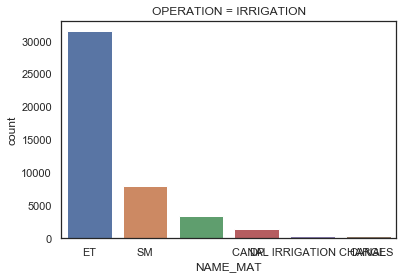
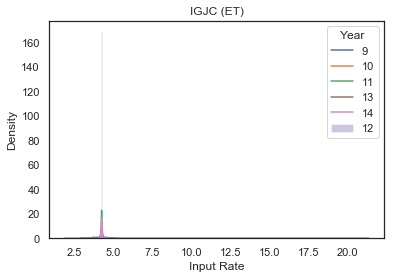
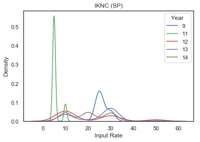
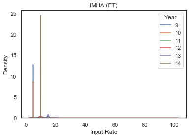
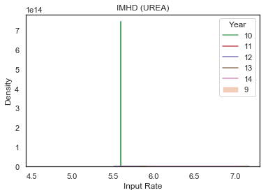
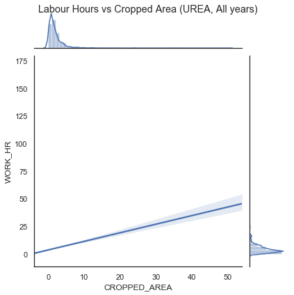

```python
import pandas as pd
import numpy as np
import math
import seaborn as sns
import matplotlib.pyplot as plt
import seaborn as sns
```


```python

```


```python
df = pd.read_csv("./Cultivation_Input_2009-14.csv")
```


```python
df.shape
df.columns

```


    Index(['VDS_ID', 'YEAR', 'STATE_VILLAGE', 'PLOT_CODE', 'CROPPED_AREA',
           'OPERATION', 'WORK_HR', 'NAME_MAT', 'RATE_MAT'],
          dtype='object')


```python

```


```python

```


```python
sub = df.loc[(df['OPERATION']=="IRRIGATION")]
ax = sns.countplot(x="NAME_MAT", data=sub, order=pd.value_counts(sub['NAME_MAT']).iloc[:6].index)
plt.title("OPERATION = IRRIGATION")
plt.show()

sub = df.loc[df['OPERATION']=="PLANT PROTECTION"]
ax = sns.countplot(x="NAME_MAT", data=sub, order=pd.value_counts(sub['NAME_MAT']).iloc[:5].index)
plt.title("OPERATION = PLANT PROTECTION")
plt.show()

sub = df.loc[df['OPERATION']=="FERTILIZER APPLICATION"]
ax = sns.countplot(x="NAME_MAT", data=sub, order=pd.value_counts(sub['NAME_MAT']).iloc[:5].index)
plt.title("OPERATION = FERTILIZER APPLICATION")
plt.show()


```





```python
df[:5].dtypes

df["RATE_MAT"] = df["RATE_MAT"].apply(pd.to_numeric, errors='coerce')
df[50:60]

```


<div>
<style scoped>
    .dataframe tbody tr th:only-of-type {
        vertical-align: middle;
    }

    .dataframe tbody tr th {
        vertical-align: top;
    }

    .dataframe thead th {
        text-align: right;
    }
</style>
<table border="1" class="dataframe">
  <thead>
    <tr style="text-align: right;">
      <th></th>
      <th>VDS_ID</th>
      <th>YEAR</th>
      <th>STATE_VILLAGE</th>
      <th>PLOT_CODE</th>
      <th>CROPPED_AREA</th>
      <th>OPERATION</th>
      <th>WORK_HR</th>
      <th>NAME_MAT</th>
      <th>RATE_MAT</th>
    </tr>
  </thead>
  <tbody>
    <tr>
      <th>50</th>
      <td>IAP09A0226</td>
      <td>9</td>
      <td>IAPA</td>
      <td>A</td>
      <td>2.0</td>
      <td>PLANT PROTECTION</td>
      <td></td>
      <td>MONOCROTOPHOS</td>
      <td>280.0</td>
    </tr>
    <tr>
      <th>51</th>
      <td>IAP09A0226</td>
      <td>9</td>
      <td>IAPA</td>
      <td>A</td>
      <td>2.0</td>
      <td>PLANT PROTECTION</td>
      <td></td>
      <td>CONFIDOR</td>
      <td>2400.0</td>
    </tr>
    <tr>
      <th>52</th>
      <td>IAP09A0226</td>
      <td>9</td>
      <td>IAPA</td>
      <td>A</td>
      <td>2.0</td>
      <td>PLANT PROTECTION</td>
      <td></td>
      <td>SP</td>
      <td>10.0</td>
    </tr>
    <tr>
      <th>53</th>
      <td>IAP09A0226</td>
      <td>9</td>
      <td>IAPA</td>
      <td>A</td>
      <td>2.0</td>
      <td>FERTILIZER APPLICATION</td>
      <td>8</td>
      <td>20-20-0</td>
      <td>7.6</td>
    </tr>
    <tr>
      <th>54</th>
      <td>IAP09A0226</td>
      <td>9</td>
      <td>IAPA</td>
      <td>A</td>
      <td>2.0</td>
      <td>FERTILIZER APPLICATION</td>
      <td>8</td>
      <td></td>
      <td>NaN</td>
    </tr>
    <tr>
      <th>55</th>
      <td>IAP09A0226</td>
      <td>9</td>
      <td>IAPA</td>
      <td>A</td>
      <td>2.0</td>
      <td>PLANT PROTECTION</td>
      <td>8</td>
      <td>ANTHACOL</td>
      <td>525.0</td>
    </tr>
    <tr>
      <th>56</th>
      <td>IAP09A0226</td>
      <td>9</td>
      <td>IAPA</td>
      <td>A</td>
      <td>2.0</td>
      <td>PLANT PROTECTION</td>
      <td></td>
      <td>MONOCROTOPHOS</td>
      <td>280.0</td>
    </tr>
    <tr>
      <th>57</th>
      <td>IAP09A0226</td>
      <td>9</td>
      <td>IAPA</td>
      <td>A</td>
      <td>2.0</td>
      <td>PLANT PROTECTION</td>
      <td></td>
      <td>CONFIDOR</td>
      <td>2400.0</td>
    </tr>
    <tr>
      <th>58</th>
      <td>IAP09A0226</td>
      <td>9</td>
      <td>IAPA</td>
      <td>A</td>
      <td>2.0</td>
      <td>PLANT PROTECTION</td>
      <td></td>
      <td>SP</td>
      <td>10.0</td>
    </tr>
    <tr>
      <th>59</th>
      <td>IAP09A0226</td>
      <td>9</td>
      <td>IAPA</td>
      <td>A</td>
      <td>2.0</td>
      <td>PLANT PROTECTION</td>
      <td>8</td>
      <td>ZIRAM</td>
      <td>140.0</td>
    </tr>
  </tbody>
</table>
</div>


```python
#villages = ["IAPA"]
villages = ['IAPA', "IAPB", "IAPC", "IAPD", "IGJA", "IGJB", "IGJC", "IGJD", "IKNA", "IKNB", "IKNC", "IKND", "IMHA", "IMHB", "IMHC", "IMHD", "IMPA", "IMPB", "ITSA", "ITSB"]


materials = ['DAP', 'UREA', 'SP', 'ET', 'SM']
for village in villages:
    for mat in materials:
        for yr in range(9,15):
            sub = df.loc[(df['STATE_VILLAGE']==village) & (df['NAME_MAT']==mat) & (df['YEAR']==yr) ]
            #print(yr, village+" ("+mat+")")
            #print(sub)
            try:
                ax = sns.distplot(sub['RATE_MAT'].dropna(), hist = False, kde = True,label = yr)
            except:
                ax = sns.distplot(sub['RATE_MAT'].dropna(), hist = True, kde = False,label = yr)
        subsub = df.loc[(df['STATE_VILLAGE']==village) & (df['NAME_MAT']==mat)]
        try:
            #plt.ylim(0, subsub['RATE_MAT'].max())
            print()
        except:
            print("")
        #plt.xlim(0, None)
        plt.legend(title = 'Year')
        plt.title(village+" ("+mat+")")
        plt.xlabel('Input Rate')
        plt.ylabel('Density')
        plt.show()
```

    


    


    


    No handles with labels found to put in legend.


    


    


    


    


    


    


    


    


    


    


    


    


    


    


    


    


    


    


    


    


    


    


    


    


    No handles with labels found to put in legend.


    


    


    


    


    


    


    





    No handles with labels found to put in legend.


    


    


    


    


    


    


    


    


    


    


    No handles with labels found to put in legend.


    


    


    


    


    


    No handles with labels found to put in legend.


    


    


    


    





    No handles with labels found to put in legend.


    


    No handles with labels found to put in legend.


    


    


    


    


    


    No handles with labels found to put in legend.


    


    


    


    


    





    No handles with labels found to put in legend.


    


    


    


    


    


    No handles with labels found to put in legend.


    


    


    


    


    


    No handles with labels found to put in legend.


    


    


    





    


    


    No handles with labels found to put in legend.


    


    


    


    


    


    No handles with labels found to put in legend.


    


    


    


    


    


    


    


    


    


    No handles with labels found to put in legend.


    


    


    


    


    


    No handles with labels found to put in legend.


    


    


```python
df["WORK_HR"] = df["WORK_HR"].apply(pd.to_numeric, errors='coerce')
df[:5].dtypes

```


    VDS_ID            object
    YEAR               int64
    STATE_VILLAGE     object
    PLOT_CODE         object
    CROPPED_AREA     float64
    OPERATION         object
    WORK_HR          float64
    NAME_MAT          object
    RATE_MAT         float64
    dtype: object


```python
sns.set(style="white", color_codes=True)
for mat in materials:
    sub = df.loc[(df['NAME_MAT']==mat)]
    lm = sns.lmplot(x="CROPPED_AREA", y="WORK_HR", data=sub, lowess=True, scatter=True, col="YEAR")
    lm.fig.suptitle("Labour Hours vs Cropped Area ("+mat+")")
    plt.show()
    lm = sns.lmplot(x="CROPPED_AREA", y="WORK_HR", data=sub, lowess=True, hue="YEAR", scatter=False)
    lm.fig.suptitle("Labour Hours vs Cropped Area ("+mat+")")
    plt.show()
    lm = sns.jointplot(x="CROPPED_AREA", y="WORK_HR", data=sub, kind="reg", scatter=False)
    lm.fig.suptitle("Labour Hours vs Cropped Area ("+mat+", All years)")
    plt.show()
```





```python

```
